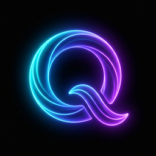
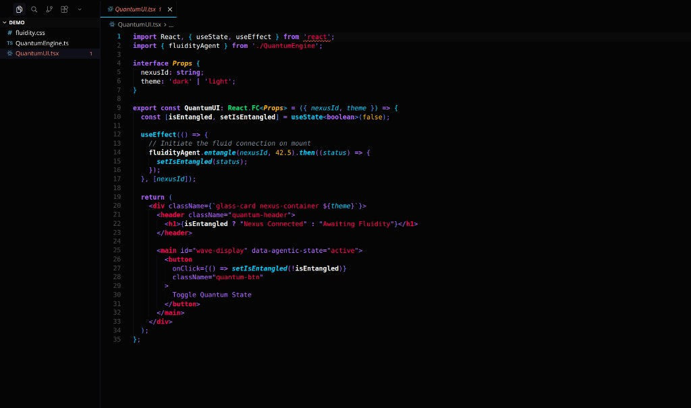
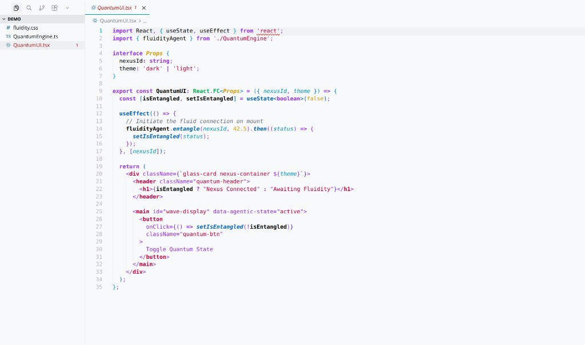

  
  <h1>Quantum Fluidity</h1>
  
<b>A crisp, high-contrast theme designed for a development environment that feels both <i>quantum</i> and <i>agentic</i>.</b>

---

**Quantum Fluidity** is a highly opinionated, dual-mode (Dark & Light) color theme built for VS Code and Cursor. It was designed from the ground up to reduce eye strain while providing vivid, structural syntax highlighting that makes object-oriented and functional code extremely easy to parse.

Whether you are building complex React interfaces, writing backend logic, or designing AI-driven agentic workflows, this theme brings a subtle glow and sharp readability to your editor.

## ✨ Features

- **Dual Modes:** Includes both the signature `Obsidian Void` dark mode and a high-contrast `Ghost White` light mode.
- **Semantic Highlighting:** Deep integration with language servers to intelligently colorize classes, interfaces, and methods based on their actual structural meaning, not just regex patterns.
- **Typographic Hierarchy:** Bold keywords and italicized parameters/attributes give your code a flowing, readable texture.
- **Quantum Brackets:** Nested brackets use a high-tech gradient to map the depth of your code seamlessly.
- **Agentic UI:** Fully customized editor UI, from the Midnight Mist file explorer selection states to the glowing Electric Cyan active tabs.

## 📸 Previews

### Quantum Fluidity (Dark)

### Quantum Fluidity Light

## 🎨 The Palette

The theme is built upon a carefully curated "Quantum" design system:

| Color | Hex (Dark) | Hex (Light) | Role / Vibe |
| :--- | :--- | :--- | :--- |
| **Obsidian Void / Ghost White** | `#050505` | `#F8F9FA` | The "Crisp" foundation; pure, deep, and stable backgrounds. |
| **Electric Cyan / Azure Blue** | `#00D1FF` | `#0066CC` | Represents "Future" and "Quantum" energy. (Functions, Methods, Borders) |
| **Hyper-Violet / Purple** | `#B266FF` | `#9933FF` | Adds "Agentic" depth and a sense of intelligence. (Keywords, Operators, Badges) |
| **Neon Emerald / Forest Green**| `#00E676` | `#00B359` | Structural distinction. (Classes, Interfaces) |
| **Neon Amber / Goldenrod** | `#FFB800` | `#D99900` | Logical primitives. (Numbers, Constants, Arguments) |
| **Quantum Pink / Crimson** | `#FF0055` | `#CC0044` | High contrast alerts and semantic literals. (Strings, HTML Tags, Errors) |
| **Midnight Mist / Slate** | `#1A1A2E` | `#E5E7EB` | Used for containers, file explorers, and hover states to create "Fluid Motion". |

## 🚀 Installation

### In Cursor / VS Code
1. Open the Extensions sidebar panel (`Ctrl+Shift+X` on Windows/Linux, `Cmd+Shift+X` on Mac).
2. Search for `Quantum Fluidity`.
3. Click **Install**.
4. Open the Command Palette (`Ctrl+Shift+P` / `Cmd+Shift+P`), type `Color Theme`, and select either **Quantum Fluidity** or **Quantum Fluidity Light**.

---

  <i>Enjoy the subtle glow and let your code flow.</i>

