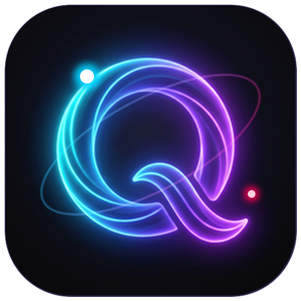
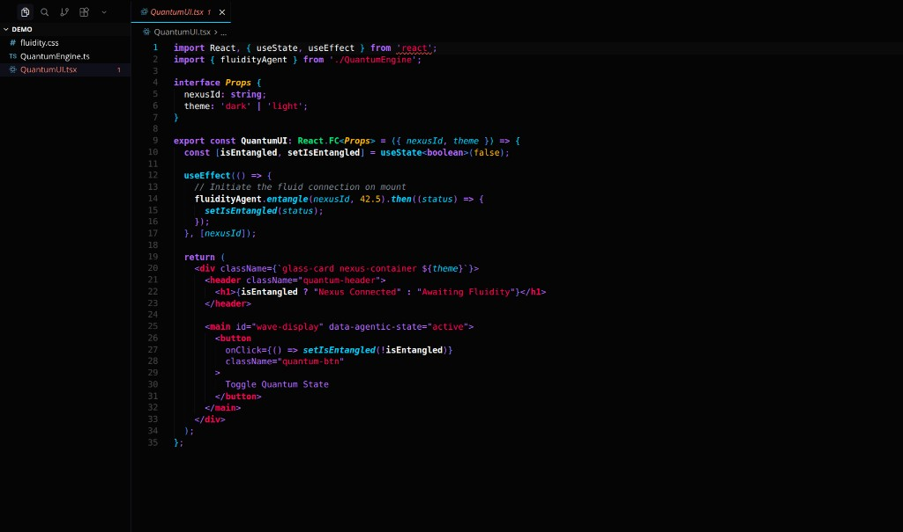
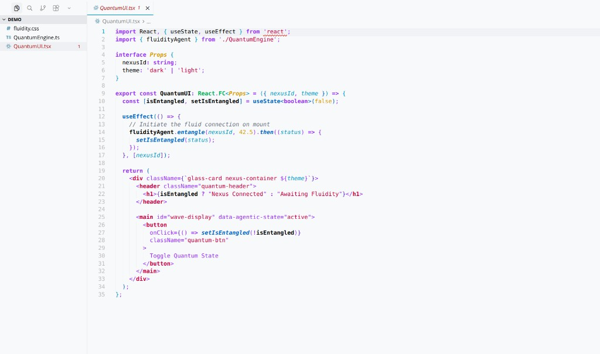

<div align="center">
  
  <h1>Quantum Fluidity</h1>
  <p><b>A crisp, high-contrast theme family designed for a development environment that feels both <i>quantum</i> and <i>agentic</i>.</b></p>
</div>

---

**Quantum Fluidity** is a highly opinionated color theme family for **VS Code**, **Cursor**, and **Kiro**. Four variants — two dark, two light — share one design system: vivid structural syntax highlighting that makes object-oriented and functional code extremely easy to parse, with WCAG-audited contrast in every variant.

## 🌗 The Four Variants

| Variant | Mode | Vibe |
| :--- | :--- | :--- |
| **Quantum Fluidity** | Dark | The signature `Obsidian Void` — pure-black foundation, maximum neon punch. |
| **Quantum Fluidity Mist** | Dark | `Midnight Mist` navy surfaces with gentler neons — cozier for long sessions and dim rooms. |
| **Quantum Fluidity Light** | Light | `Ghost White` — cool, crisp, high-contrast daylight coding. |
| **Quantum Fluidity Dawn** | Light | Warm paper surfaces with earthy quantum accents — easy on the eyes in bright environments. |

## ✨ Features

- **2 × 2 modes:** Two dark and two light variants, all generated from a single palette source so they stay perfectly in sync.
- **WCAG-audited:** Every syntax color clears 4:1 contrast against its background (7:1+ for body text); brackets and hints clear 3:1. Verified by an automated check (`npm run check`).
- **Semantic Highlighting:** Deep integration with language servers to intelligently colorize classes, interfaces, enums, type parameters, decorators, and methods based on their actual structural meaning, not just regex patterns. Deprecated symbols are struck through.
- **Typographic Hierarchy:** Bold keywords and italicized parameters/attributes give your code a flowing, readable texture.
- **Quantum Brackets:** Nested brackets ramp through a full six-level cyan → violet → pink gradient that maps the depth of your code, with a matching-bracket glow to anchor your cursor.
- **Agentic Polish:** Purpose-built for AI-first editors — inline AI suggestions (ghost text) and inlay hints are styled on-palette so generated code reads as cleanly as code you wrote yourself.
- **Full UI Coverage:** Menus, peek views, notifications, command palette, git decorations, merge conflicts, sticky scroll, debug and testing icons, terminal ANSI — all themed.

## 📸 Previews

### Quantum Fluidity (Dark)


### Quantum Fluidity Light


## 🎨 The Palette

The theme family is built upon a carefully curated "Quantum" design system. Each role keeps its meaning across all four variants:

| Role | Void (Dark) | Mist (Dark) | Light | Dawn (Light) |
| :--- | :--- | :--- | :--- | :--- |
| **Foundation** (backgrounds) | `#050505` | `#131324` | `#F8F9FA` | `#FAF5EC` |
| **Electric Cyan** (functions, cursor, borders) | `#00D1FF` | `#3BD5FF` | `#007399` | `#0E7490` |
| **Hyper-Violet** (keywords, operators, badges) | `#B266FF` | `#BE83FF` | `#7C24D9` | `#8B2FC9` |
| **Neon Emerald** (classes, types) | `#00E676` | `#2EE68A` | `#067A43` | `#2E7D32` |
| **Neon Amber** (numbers, constants) | `#FFB800` | `#FFC53D` | `#A36A00` | `#A05A08` |
| **Quantum Pink** (strings, tags, errors) | `#FF0055` | `#FF4D7E` | `#CC0044` | `#B3264A` |
| **Containers** (mist surfaces, hovers) | `#1A1A2E` | `#262645` | `#E5E7EB` | `#E7DCC8` |

## 🚀 Installation

### VS Code
1. Open the Extensions panel (`Ctrl+Shift+X` / `Cmd+Shift+X`).
2. Search for `Quantum Fluidity` and click **Install**.
3. `Ctrl+K Ctrl+T` (or Command Palette → `Color Theme`) and pick your variant.

### Cursor
Cursor reads the same extension format. Search `Quantum Fluidity` in Cursor's Extensions panel (served via its marketplace mirror / Open VSX), or install the `.vsix` manually (below).

### Kiro
Kiro consumes extensions from **Open VSX**. Search `Quantum Fluidity` in Kiro's extensions view, or use the manual `.vsix` install.

### Manual (.vsix) — works in all three IDEs
1. Grab the latest `.vsix` from [Releases](https://github.com/I4cTime/quantum-fluidity-theme/releases), or build it yourself: `npm run package`.
2. Command Palette → `Extensions: Install from VSIX...` → select the file.

## 🛠️ Development

The four theme JSONs are **generated** — don't edit `themes/*.json` by hand.

```bash
npm run build    # regenerate themes/*.json from src/palettes.mjs
npm run check    # WCAG contrast audit (fails CI on regression)
npm run package  # build + check + create .vsix
```

- `src/palettes.mjs` — the single source of truth: one flat palette object per variant.
- `src/template.mjs` — maps a palette onto the full VS Code theme structure (workbench colors, semantic tokens, TextMate scopes).
- `src/check-contrast.mjs` — WCAG luminance-contrast audit for every palette.

To add a fifth variant: add a palette object, `npm run build`, add the theme entry to `package.json`.

### Releasing

CI (`.github/workflows/ci.yml`) runs on every push/PR: regenerates themes, fails if `themes/*.json` were hand-edited, runs the contrast audit, and does a dry-run package.

Pushing a `v*` tag (e.g. `git tag v2.0.0 && git push origin v2.0.0`) triggers `.github/workflows/release.yml`, which publishes the same `.vsix` to **both** the VS Code Marketplace and **Open VSX** (where Cursor and Kiro install from), and attaches it to a GitHub Release. Requires two repo secrets: `VSCE_PAT` (Azure DevOps, Marketplace → Manage scope) and `OVSX_PAT` (open-vsx.org token; create the `I4cTime` namespace once with `npx ovsx create-namespace`).

---

<div align="center">
  <i>Enjoy the subtle glow and let your code flow.</i>
</div>
